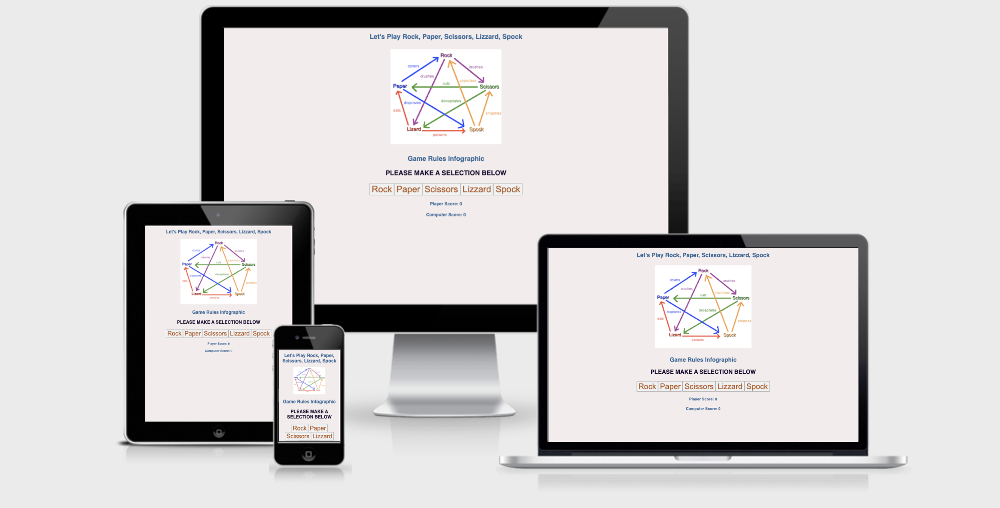
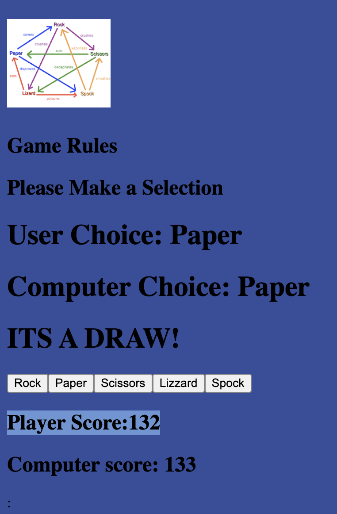

# Rock Paper Scissors Lizzard Spock

Rock, paper, scissors, lizard spock is an expanded version of the traditional rock, paper, scissors to include 5 posibble choices as opposed to three. The rules are set out in the below paragraph.

## The rules: 
"Scissors decapitate Scissors cuts paper, paper covers rock, rock crushes lizard, lizard poisons Spock, Spock smashes scissors, scissors decapitates lizard, lizard eats paper, paper disproves Spock, Spock vaporizes rock, and as it always has, rock crushes scissors."

## Features:

1.	Header - There is a plane text header introducing the name of the game with an infographic image showing a visual representation of the rules. The header and image, clearly identify the game name and the infographic is the best way to represent the rules and outcomes in a non text way.

2.	 The Game Options: The user is asked to make a selection below which clearly infers that the user should click one of the buttons to choose a character. The JavaScript code then assigns a choice to the computer, and creates headings which print out the user choice, the computer choice and declares the winner if there is one( otherwise a draw is declared)

3.	The Score section:  Within the switch statement, the users score increments up by one if they are the winner, and the computers score iterates up one if they win. In the event of a draw neither score iterates.

## Features left to implement:

When I have time I would like to add a separate rules pages, and add some more styling using images and emojis.

## Testing:

I used developer tools to test this site on multiple screen sizes in chrome. I also tested the game several times, and over a 100 continous games there was no faults, and the deviation between the computer score and user score was never more than 20% once we got over 30 iterations. Which is what we would expect given that the game is a chance, and involves no skill level (every choice by the computer is an individual random event and every character has an equal strength/weakness ratio) Plesae see below image.

